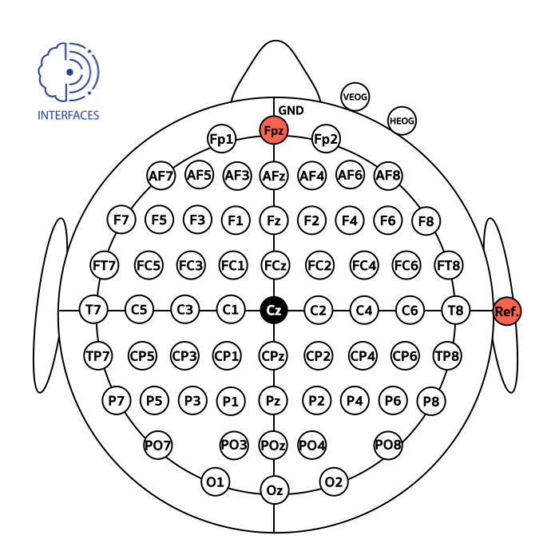
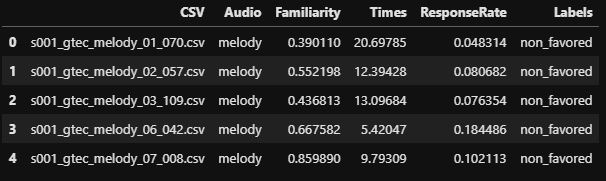

# MUSEC-MusicPreference-Behaviors-EEG

# Revealing Preference in Popular music Through Familiarity and Brain Response
### [This work](https://doi.org/10.1109/JSEN.2021.3073040) is published in IEEE Sensors Journal 

### For accessing to the dataset, please send your CV and cover letter to Dr.Theerawit Wilaiprasitporn (theerawit.w@vistec.ac.th)

## Abstract

**Music preference was reported as a factor, which could elicit innermost music emotion, entailing accurate ground-truth data and music therapy efficiency. This study executes statistical analysis to investigate the distinction of music preference through familiarity scores, response times (response rates), and brain response (EEG). Twenty participants did self-assessment after listening to two types of popular music’s chorus section: music without lyrics (Melody) and music with lyrics (Song). We then conduct a music preference classification using a support vector machine, random forest, and k-nearest neighbors with the familiarity scores, the response rates, and EEG as the feature vectors. The statistical analysis and F1-score of EEG are congruent, which says that the brain’s right side outperformed its left side in classification performance. Finally, these behavioral and brain studies support that preference, familiarity, and response rates can contribute to the music emotion experiment’s design to understand music, emotion, and listener. Not only to the music industry, the biomedical and healthcare industry can also exploit this experiment to collect data from patients to improve the efficiency of healing by music.**

## Data description
The dataset was divided into 2 audio types: Melody and Song.

Each audio contains:
* [EEG and EOG raw data](#eeg_eog_dataset)
* [Behaviors data (Familiarity, Times, and Response Rate) and Preference labels (favoured and non_favoured)](#behaviors_labels_dataset)

For using dataset, you can see the code of guidance in <mark>dataset_processing.ipynb,/mark>
## Dataset 
<h3 id="eeg_eog_dataset">EEG and EOG</h3>
<!-- <br>EEG and EOG -->

The dataset contains the 4 music preference groups such as favoured Melody, favoured Song, non_favoured Melody, non_favoured Song as follows:

```
favoured
└─ favoured_melody (81 files)
    └─ s001_gtec_melody_20_030.csv
    └─ s002_gtec_melody_10_082.csv
    .
    .
    .
    └─ s020_gtec_melody_05_022.csv
    
└─ favoured_song (81 files)
    └─ s001_gtec_song_20_030.csv
    └─ s002_gtec_song_10_082.csv
    .
    .
    .
    └─ s020_gtec_song_05_022.csv
    
---------------------------------------
non_favoured
└─ non_favoured_melody (271 files)
    └─ s001_gtec_melody_01_070.csv
    └─ s001_gtec_melody_02_057.csv
    .
    .
    .
    └─ s020_gtec_melody_22_012.csv
    
└─ non_favoured_song (271 files)
    └─ s001_gtec_song_01_070.csv
    └─ s001_gtec_song_02_057.csv
    .
    .
    .
    └─ s020_gtec_song_22_012.csv


```
<!-- Each .csv file contains 64 columns as follows: 
* EEG: 62 channels (Columns 1-62)
* EOG: 2 channels (Columns 63-64) -->

As shown in Fig. 1, the EEG data were acquired by using 62 active electrodes and placed according to the 10-20 international system. The EEG channels were referenced and grounded using the right earlobe and the $Fpz$ electrode, respectively. The EOG signals were obtained from two electrodes positioned under and next to the outer canthus of the right eye. The impedance of both EEG and EOG electrodes were maintained below 10 k$\Omega$ during the entire experiment. The length of each files is the length of each audio with sampling rates 1200 Hz.
    
<p align='center'>

</p>
<p align='center'> <b>Fig. 1</b> The location of EEG and EOG electrodes.</p>


<h3 id="behaviors_labels_dataset">Behaviors and Preference labels</h3>
All behaviors and preference labels were collected in 'behaviors.csv' as follows:

<p align='center'>

</p>
    
    
<h3 id="filename_convention">File naming convention</h3>

* subject_number
    - s001 - s020
* gtec
* audio types
    - Melody or Song
* listened sequence
    - 01 - 22, due to participants randomly listened to 22 music.
* music_number
    - 001 - 110, we have 110 music in this work.
    
For example, ‘s001_gtec_song_01_010.csv’:
    
    - subject_number: s001
    - gtec
    - audio types: song
    - listened sequence: 01
    - music_number: 010
    
    
## Citation
When using any part of this dataset, please cite [our paper](https://doi.org/10.1109/JSEN.2021.3073040)

```
@ARTICLE{sangnark2021musicpreference,
    author={S. {Sangnark} and P. {Autthasan} and P. {Ponglertnapakorn} and P. {Chalekarn} and 
    T. {Sudhawiyangkul} and M. {Trakulruangroj} and S. {Songsermsawad} and
    R. {Assabumrungrat} and S. {Amplod} and K. {Ounjai} and T. {Wilaiprasitporn}},
    journal={IEEE Sensors Journal}, 
    title={Revealing Preference in Popular Music Through Familiarity and Brain Response}, 
    year={2021},
    pages={1-1}
    }
    
